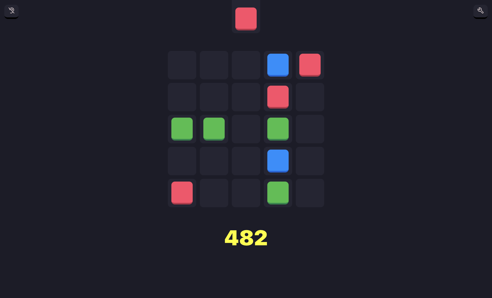

# Match City


Web Game about matching tiles! Supports multiple color-schemes and persistent theme settings.

<!-- 
 -->

| Desktop                                     | Mobile                                        |
| ------------------------------------------- | --------------------------------------------- |
|  |  |

## Developing 🛠

After you've cloned/forked/whatever the repo, you can do this:

```bash
npm run install
npm run dev
```

## Credits

### Sounds

- [Hidden Folks Mouth Sounds](https://adriaan.itch.io/hidden-folks-mouth-sounds)

### Icons

- [Tabler Icons](https://tablericons.com/)

#### Colors

- [tailwind](https://tailwindcss.com/)

- [lospec](https://lospec.com/palette-list)

### Inspired by

- [THREES](https://dennissmuda.github.io/match-city/)

- [Triple Town](https://spryfox.com/our-games/tripletown/)

- [YMBAB](https://store.steampowered.com/app/290890/You_Must_Build_A_Boat/)

- [2048](https://play2048.co/)

> Feel free to suggest more matching games 🟥
